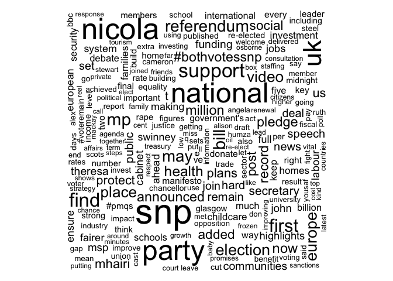
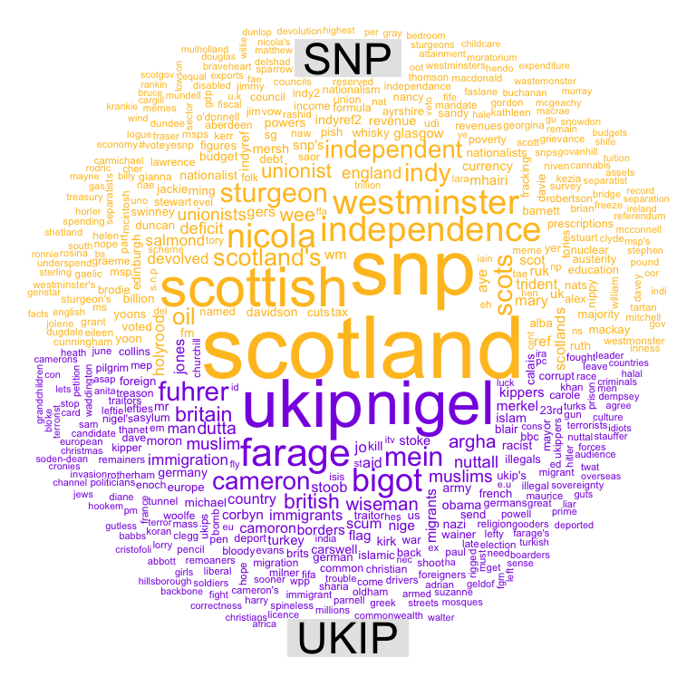

# SNP vs UKIP Keyness Analysis
Justin Chun-ting Ho  
5/25/2017  


This vignette presents a Keyness Analysis of the posts and comments of the Scottish National Party (SNP) and the UK Independence Party (UKIP). Keyness refers to the quality a word (or a feature) has of being "key" in differentiating one corpus from another. In other words, keywords are "items of unusual frequency in comparison with a reference corpus".

## Loading Packages

This vignette is going to use these five packages: 


```r
require(readtext)
require(quanteda)
require(magrittr)
require(dplyr)
require(wordcloud)
```

## Loading the Text Corpura

Next, we are going to load the corpura. The corpura were collected in May 2017 from SNP and UKIP's public Facebook page, unfortunately, the corpura are too large to be uploaded onto Gihub, but the codes in this vignette can be used on most other corpura.


```r
snp <-  corpus(readtext("SNP_fullstats.csv", textfield = "post_message"))
docvars(snp, "Party") <- "SNP"
```

We could use `cat()` to have a peck.


```r
cat(snp[1:3]) # Displaying the first 3 documents
```

```
## John Swinney SNP met young people today to talk votes at 16 and 17  In 21st century Scotland  it is ridiculous that anyone should suffer from food poverty. The UK Government s welfare cuts have placed some of the most vulnerable people  and increasing numbers of working people and their families too  into poverty.  - SNP MSP Christina McKelvie Sad news today with the death of Charlie Kennedy.
```

The folowing codes do two things: first, tokenising the text into tokens; second, creating a Document-Feature Matrix from the tokens.


```r
snptokens <- tokens(snp, remove_punct = TRUE, remove_numbers = TRUE, verbose = FALSE, remove_url = TRUE)
snpdfm <- dfm(snptokens, remove = c(stopwords('english'), "s", "http")) %>% 
  dfm_trim(min_doc = 5, min_count = 10) %>% 
  dfm_weight(type = 'tfidf')
```

We can use `topfeatures()` to see the most common words of the corpus.


```r
topfeatures(snpdfm)
```

```
##   scotland        snp   scottish government     nicola   sturgeon 
##   324.9589   305.3087   299.2164   254.0677   250.3998   246.2121 
##       will      party   national       read 
##   234.8084   232.3340   231.6727   223.1298
```
And, of course, we can do wordcloud too.


```r
textplot_wordcloud(snpdfm)
```



Now we do the same thing with the UKIP corpus.


```r
ukip <-  corpus(readtext("ukip_fullstats.csv", textfield = "post_message"))
cat(ukip[1:3])
```

```
## Voters will be asked 'Should the United Kingdom remain a member of the European Union? when they go to the polls for the in/out referendum  it has been confirmed.  In response UKIP Leader Nigel Farage said:  It is a simple straightforward  unambiguous question. That much is clear.   However that Cameron is opting to give the pro-EU side the positive  Yes  suggests strongly that his negotiations are so much fudge. He has already decided which way he wants the answer to be given  without a single power repatriated.  UKIP Deputy Leader Paul Nuttall MEP: "Sepp Blatter's position as FIFA president was already on shaky ground but now surely no one will argue that it is in any way tenable.  "Pretty much all of the crimes being alleged happened on his watch. If he knew about it  then he should be prosecuted. If he didn't know about it  then he wasn't doing his job properly and should be removed.   Grassroots football in some of the world's poorest countries and fans everywhere are the apparent victims of these crimes.  "Only a root and branch clear out at FIFA will satisfy them that we're cleaning up the game once and for all." UKIP MEP Louise Bours said:  The EU continues to suffer economic and unemployment disaster yet the EC wastes taxpayers  money to decide how much coffee adults should drink.   This study by the EU food safety quango is absurd and wasteful. Its findings are patronising for pregnant women. They have medical advice. They don t need bossy Brussels.
```

```r
docvars(ukip, "Party") <- "UKIP"
ukiptokens <- tokens(ukip, remove_punct = TRUE, remove_numbers = TRUE, verbose = FALSE, remove_url = TRUE)
ukipdfm <- dfm(ukiptokens, remove = c(stopwords('english'), "s", "http")) %>% 
  dfm_trim(min_doc = 5, min_count = 10) %>% 
  dfm_weight(type = 'tfidf')
topfeatures(ukipdfm)
```

```
##       eu     will   people       uk    nigel   farage european   leader 
## 329.3331 298.1561 227.6134 223.4786 217.1207 210.0337 209.7742 207.2822 
##      mep      can 
## 204.7251 192.2940
```

Now, we are all set up for the Keyness Analysis, in the quantenda package, the code would be `textstat_keyness()`.


```r
kwdspage <- textstat_keyness(rbind(snpdfm, ukipdfm), target = seq_along(snptokens))
```

These are the top 20 SNP words:

```r
head(kwdspage, 20)
```

```
##                    chi2 p  n_target n_reference
## snp           469.41812 0 305.30873     0.00000
## nicola        384.21911 0 250.39982     0.00000
## sturgeon      377.72699 0 246.21205     0.00000
## scottish      369.71247 0 299.21639    28.46064
## scotland      335.16918 0 324.95895    56.49398
## scotland's    204.54171 0 134.30168     0.00000
## shared        179.38832 0 181.70650    34.45871
## national      138.60282 0 231.67272    92.79983
## pledge        137.09242 0  90.61299     0.00000
## #bothvotessnp 132.94242 0  87.92297     0.00000
## read          129.80989 0 223.12976    91.84224
## mhairi        123.86770 0  82.03994     0.00000
## results       119.51884 0  79.22024     0.00000
## black         112.99535 0  74.99006     0.00000
## holyrood      110.16541 0  73.15479     0.00000
## cuts          110.04552 0  73.07704     0.00000
## tories        109.48939 0 128.43313    32.10025
## angus         102.97553 0  68.49151     0.00000
## poverty        99.81500 0  66.44139     0.00000
## robertson      99.28685 0  66.09878     0.00000
```

These are the top 20 UKIP words:

```r
tail(kwdspage, 20)
```

```
##                   chi2            p n_target n_reference
## whittle      -54.73329 1.380007e-13        0    86.63295
## spread       -57.77242 2.942091e-14        0    91.29813
## peter        -58.51605 2.020606e-14        0    92.43953
## believe      -59.59318 1.165734e-14        0    94.09272
## says         -63.55804 1.554312e-15        0   100.17725
## migration    -64.48608 9.992007e-16        0   101.60125
## borders      -67.69474 2.220446e-16        0   106.52415
## defence      -75.28798 0.000000e+00        0   118.17100
## immigration  -78.47525 0.000000e+00        0   123.05849
## control      -82.20145 0.000000e+00        0   128.77142
## spokesman    -88.69143 0.000000e+00        0   138.71925
## nuttall      -94.65383 0.000000e+00        0   147.85569
## paul        -100.01647 0.000000e+00        0   156.07088
## britain     -106.73507 0.000000e+00        0   166.36034
## london      -107.67552 0.000000e+00        0   167.80038
## ukip        -110.17431 0.000000e+00        0   171.62625
## british     -123.45259 0.000000e+00        0   191.94895
## mep         -131.80442 0.000000e+00        0   204.72514
## farage      -135.27562 0.000000e+00        0   210.03374
## nigel       -139.91057 0.000000e+00        0   217.12074
```

Not surprisingly, SNP uses Scotland, Scotish and the name of Nicola Sturgeon distinctively. We can also see the UKIP favours words like control, immigration, migration, borders, and defence.

## Page Comments

Let's turn to comments, same process.


```r
snpcom  <-  corpus(readtext("snp_comments.csv", textfield = "comment_message"))
```

```
## 
Read 14.0% of 571079 rows
Read 29.8% of 571079 rows
Read 45.5% of 571079 rows
Read 63.0% of 571079 rows
Read 85.8% of 571079 rows
Read 571079 rows and 11 (of 11) columns from 0.303 GB file in 00:00:08
```

```r
docvars(snpcom, "Party") <- "SNP"
snpcomtokens <- tokens(snpcom, remove_punct = TRUE, remove_numbers = TRUE, verbose = FALSE, remove_url = TRUE)
snpcomdfm <- dfm(snpcomtokens, remove = c(stopwords('english'), "s", "http")) %>% 
  dfm_trim(min_doc = 5, min_count = 10) %>% 
  dfm_weight(type = 'tfidf')
topfeatures(snpcomdfm) # This is not necessarily but it is a good practice to check anyway
```

```
##  scotland      will        eu       snp        uk    people  scottish 
## 108309.14  90830.64  90092.99  89424.29  78747.24  76896.57  62582.38 
##      vote      just       get 
##  61597.05  60872.98  58624.02
```


```r
ukipcom  <-  corpus(readtext("ukip_comments.csv", textfield = "comment_message"))
```

```
## 
Read 10.6% of 660106 rows
Read 34.8% of 660106 rows
Read 71.2% of 660106 rows
Read 660106 rows and 11 (of 11) columns from 0.468 GB file in 00:00:06
```

```r
docvars(ukipcom, "Party") <- "UKIP"
ukipcomtokens <- tokens(ukipcom, remove_punct = TRUE, remove_numbers = TRUE, verbose = FALSE, remove_url = TRUE)
ukipcomdfm <- dfm(ukipcomtokens, remove = c(stopwords('english'), "s", "http")) %>% 
  dfm_trim(min_doc = 5, min_count = 10) %>% 
  dfm_weight(type = 'tfidf')
topfeatures(ukipcomdfm) # This is not necessarily but it is a good practice to check anyway
```

```
##        eu      will    people      ukip       get      vote   country 
## 111568.08 110107.28  92962.62  77370.46  76432.67  73609.10  72282.08 
##        us      just       can 
##  70046.42  65556.07  65304.12
```


```r
kwds <- textstat_keyness(rbind(snpcomdfm, ukipcomdfm), target = seq_along(snpcomtokens))
```

Again, these are the top 20 SNP words in comments:

```r
head(kwds, 20)
```

```
##                   chi2 p   n_target n_reference
## scotland     87701.108 0 108309.141  10048.7205
## snp          78186.327 0  89424.293   5966.6822
## scottish     52514.700 0  62582.383   5030.6388
## independence 29727.543 0  47712.266   8507.5686
## westminster  29369.630 0  39757.327   4879.9413
## nicola       28708.892 0  30743.953   1346.7619
## sturgeon     21367.725 0  26692.613   2559.5433
## scots        20399.767 0  26142.905   2729.8967
## indy         19031.128 0  18453.437    176.3451
## independent  18397.411 0  29158.515   5076.3223
## scotland's   17706.387 0  17920.135    435.7083
## oil          16763.220 0  23803.282   3292.8498
## unionist     13183.916 0  13092.237    232.0713
## wee          12033.249 0  13319.651    731.4149
## unionists     9852.095 0   9600.033    106.9893
## england       9188.910 0  35976.746  15707.0689
## deficit       8924.705 0  12673.795   1751.9780
## holyrood      8123.195 0   8192.752    188.3765
## salmond       7846.873 0   8446.644    382.8388
## devolved      7545.925 0   8274.777    427.3872
```

These are the top 20 UKIP words in comments:

```r
tail(kwds, 20)
```

```
##                   chi2 p   n_target n_reference
## scum         -6023.550 0     0.0000    6385.105
## country      -6047.861 0 42627.5595   72282.083
## immigrants   -6198.431 0  7254.6547   21407.006
## jo           -6367.329 0   973.3675    9397.341
## immigration  -6685.851 0  7742.2024   22948.042
## nuttall      -7826.041 0   119.1854    8659.602
## muslim       -8298.993 0  2247.7873   14528.127
## muslims      -8555.205 0  2046.8837   14367.830
## dutta        -8796.708 0     0.0000    9323.125
## wiseman      -9555.915 0     0.0000   10127.396
## argha        -9672.758 0     0.0000   10251.171
## british     -11993.265 0 18701.2234   49169.705
## britain     -12128.124 0 14601.7433   42566.012
## cameron     -16172.198 0 12135.2110   43807.392
## fuhrer      -17705.271 0   181.4220   19316.995
## mein        -18146.532 0   147.8826   19682.155
## bigot       -23291.104 0  1813.2021   29884.800
## farage      -29398.089 0  2809.5532   39093.984
## nigel       -51019.847 0  1772.0113   59307.093
## ukip        -56421.099 0  6319.1029   77370.458
```

Blah Blah?

## Comparison Cloud

To visualise it, we can generate a comparison cloud. In the following chunck, I am selecting all the keywords with p-value equals to or small than 0.05.

```r
kwdssig <- data.frame(term = row.names(kwds), chi2 = kwds$chi2, p=kwds$p) %>% 
  filter(kwds$p <= 0.05) %>% 
  select(term, chi2)
row.names(kwdssig) <- kwdssig$term
kwdssig$SNP <- kwdssig$chi2
kwdssig$UKIP <- kwdssig$chi2
kwdssig$UKIP[kwdssig$UKIP > 0] <- 0
kwdssig$SNP[kwdssig$SNP < 0] <- 0
kwdssig <- kwdssig[,-1:-2]
```

To plot the comparison cloud.

```r
set.seed(1024)
comparison.cloud(kwdssig, random.order=FALSE, colors = c("goldenrod1","blueviolet"),scale=c(6,.6), title.size=3, max.words=500)
```




